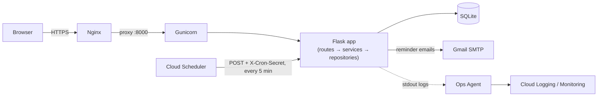

# StartBy

A task manager web app built for the NPN GCP Hackathon (Use Case 1), deployed
on a single Google Compute Engine VM at ₹0 cost. See [`PRD.md`](PRD.md) for
the full spec and [`CLAUDE.md`](CLAUDE.md) for how this repo is built sprint
by sprint.

**Status: Sprint S4 (Finish Phase 1) complete locally.** Auth, task CRUD,
the full UI (dashboard, tasks, edit modal, activity, settings), dark mode,
and the reminder cron + SMTP notifier are all working and tested. **Not yet
deployed** — the VM, HTTPS certificate, Cloud Scheduler job and uptime check
in `deploy/README-deploy.md` still need to be done by hand on the GCP
Console, so `v1.0` is not tagged yet (the PRD ties that tag to every Phase 1
acceptance box being checked *on the VM*, not just locally).

## Features

- Full task CRUD (add, edit, complete/reopen, soft-delete) with per-user
  isolation
- Tags (work/study/personal), status badges (pending/done/overdue — computed,
  never stored), search and filters
- Dashboard with live counters and a "due next" list
- Activity log: every create/edit/complete/reopen/delete, with before/after
  values, newest first
- Dark mode (saved per user, applied server-side — no flash on load) and a
  settings page for timezone
- Due-date email reminders ("due within 24h" and "overdue"), each sent at
  most once per task, triggered by a single protected cron endpoint
- Mobile-first responsive layout (360px and up)

## Architecture



Routes handle HTTP only, services hold business rules, repositories hold
parameterised SQL — no ORM. All times are stored as UTC and converted to the
user's timezone only at display time (`app/timeutil.py` is the single place
that logic lives). Phase 2 (Gemini-assisted capture, effort estimates, risk
radar) plugs into the extension points already in the code
(`app/services/hooks.py`, feature flags in `.env`) without touching Phase 1.

See [`docs/decisions/`](docs/decisions/) for why Flask/SQLite/a VM/vanilla JS
over the obvious alternatives.

## Local setup (~5 minutes)

```bash
python3 -m venv .venv
source .venv/bin/activate        # Windows: .venv\Scripts\activate
pip install -r requirements-dev.txt
cp .env.example .env             # edit SECRET_KEY at minimum
python wsgi.py                   # http://127.0.0.1:5000
```

Visit `/register` to create an account. The SQLite database is created
automatically at `instance/app.db` (gitignored) and migrated on first run —
nothing else to set up.

To explore with realistic data instead of a blank account:

```bash
python scripts/seed.py            # creates the demo user from .env + 30 tasks
python scripts/seed.py --reset    # wipe and recreate it (e.g. before a demo)
```

## Tests

```bash
pytest                                        # run the suite
pytest --cov=app --cov-report=term-missing    # with coverage
ruff check . && ruff format --check .         # lint
```

63 tests, 95% coverage on `app/`. Every PRD logic invariant (I1–I9 so far)
has a named test, e.g. `test_I7_due_soon_reminder_sent_exactly_once...`.

## Deploy

See [`deploy/README-deploy.md`](deploy/README-deploy.md) for the exact VM
steps, cost traps, and rollback procedure. Summary: Compute Engine e2-micro
in `us-central1` (Always Free), Nginx + Gunicorn (2 workers) behind
Let's Encrypt, one Cloud Scheduler job hitting `/api/cron/reminders`, and a
Cloud Monitoring uptime check on `/healthz`.

## Roadmap

**Built now (Phase 1):** everything in Features above.

**Next (Phase 2, behind feature flags, flags-off = identical to v1.0):**
effort estimates + start-by time, a green/amber/red risk radar, start-now
reminders, per-tag estimate correction, Gemini-assisted "smart capture" from
pasted text or a PDF (with a regex + `dateparser` fallback if Gemini is
unavailable), and an overload-warning report card.

## Credits

Patterns adopted from (no code copied — see `CLAUDE.md` section 4):

- [Flask's official tutorial ("flaskr")](https://github.com/pallets/flask/tree/main/examples/tutorial) —
  app factory, blueprints, a per-request DB connection, pytest fixtures with
  a temp database.
- Miguel Grinberg's [Flask Mega-Tutorial](https://blog.miguelgrinberg.com/post/the-flask-mega-tutorial-part-i-hello-world) —
  Flask-Login usage, config from environment variables, Gunicorn + Nginx +
  systemd deployment shape.
- [Vikunja](https://vikunja.io/) — feature/UX ideas only (it's AGPL-licensed,
  so no code was taken from it).
