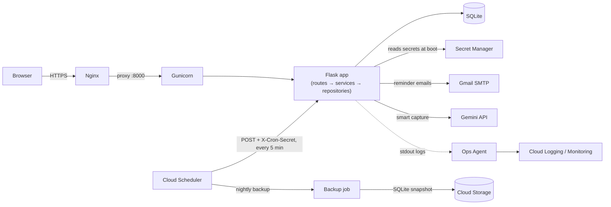

# StartBy

A task manager web app built for the NPN GCP Hackathon (Use Case 1), deployed
on a single Google Compute Engine VM at ₹0 cost. See [`PRD.md`](PRD.md) for
the full spec and [`CLAUDE.md`](CLAUDE.md) for how this repo is built sprint
by sprint.

**Status: Phase 1 complete, Phase 2 in progress (4 of 6 features shipped).**
Auth, task CRUD, the full UI, dark mode, and the reminder cron are all
working and tested, and behind `FEATURE_ESTIMATES`: effort estimates +
start-by time, a green/amber/red risk radar with a "Do this now" card,
start-now reminders, and a per-tag estimate-correction multiplier learned
from completed tasks. **Not yet deployed** — the VM, HTTPS certificate,
Cloud Scheduler job and uptime check in `deploy/README-deploy.md` still
need to be done by hand on the GCP Console, so `v1.0` is not tagged yet.

## Features

- Full task CRUD (add, edit, complete/reopen, soft-delete) with per-user
  isolation
- Tags (work/study/personal), status badges (pending/done/overdue — computed,
  never stored), search and filters
- Dashboard with live counters and a "due next" list
- Activity log: every create/edit/complete/reopen/delete, with before/after
  values, newest first
- Dark mode (saved per user, applied server-side — no flash on load) and a
  settings page for timezone
- Due-date email reminders ("due within 24h" and "overdue"), each sent at
  most once per task, triggered by a single protected cron endpoint
- Mobile-first responsive layout (360px and up)
- *(behind `FEATURE_ESTIMATES`)* Effort estimates with a predicted start-by
  time, a green/amber/red risk radar and dashboard "Do this now" card,
  start-now email reminders, and a per-tag estimate-correction multiplier
  that learns from actual-vs-estimated hours on completed tasks

## Architecture



Routes handle HTTP only, services hold business rules, repositories hold
parameterised SQL — no ORM. All times are stored as UTC and converted to the
user's timezone only at display time (`app/timeutil.py` is the single place
that logic lives). Phase 2 plugs into the extension points already in the
code (`app/services/hooks.py`, feature flags in `.env`) without touching
Phase 1.

**GCP services:** Compute Engine (runs the app), Cloud Scheduler (reminder
cron + nightly backup trigger), Cloud Monitoring + Cloud Logging (uptime
check and structured logs via the Ops Agent), Secret Manager (`SECRET_KEY`,
`SMTP_PASSWORD`, `CRON_SECRET` instead of a `.env` file on the VM), Cloud
Storage (nightly SQLite backup, so the VM's disk isn't the only copy of the
data), and the Gemini API (Phase 2 smart capture). Cloud Build/Artifact
Registry and the Cloud Natural Language API were evaluated and are written
up as considered alternatives rather than second live integrations — see
[`docs/decisions/0007-gcp-service-breadth.md`](docs/decisions/0007-gcp-service-breadth.md)
for why, including the one open question (Cloud Run Functions vs. this
single-VM design) still pending a team decision.

See [`docs/decisions/`](docs/decisions/) for why Flask/SQLite/a VM/vanilla JS
over the obvious alternatives.

## Local setup (~5 minutes)

```bash
python3 -m venv .venv
source .venv/bin/activate        # Windows: .venv\Scripts\activate
pip install -r requirements-dev.txt
cp .env.example .env             # edit SECRET_KEY at minimum
python wsgi.py                   # http://127.0.0.1:5000
```

Visit `/register` to create an account. The SQLite database is created
automatically at `instance/app.db` (gitignored) and migrated on first run —
nothing else to set up.

To explore with realistic data instead of a blank account:

```bash
python scripts/seed.py            # creates the demo user from .env + 30 tasks
python scripts/seed.py --reset    # wipe and recreate it (e.g. before a demo)
```

## Tests

```bash
pytest                                        # run the suite
pytest --cov=app --cov-report=term-missing    # with coverage
ruff check . && ruff format --check .         # lint
```

128 tests, ruff clean. Every PRD logic invariant (I1–I13 so far) has a named
test, e.g. `test_I7_due_soon_reminder_sent_exactly_once...`.

## Deploy

See [`deploy/README-deploy.md`](deploy/README-deploy.md) for the exact VM
steps, cost traps, and rollback procedure as it stands today: Compute Engine
e2-micro in `us-central1` (Always Free), Nginx + Gunicorn (2 workers) behind
Let's Encrypt, a `.env` file for secrets, one Cloud Scheduler job hitting
`/api/cron/reminders`, and a Cloud Monitoring uptime check on `/healthz`.
**Planned, not yet written into that doc:** moving secrets to Secret
Manager and a second Cloud Scheduler job for a nightly SQLite backup to
Cloud Storage — see [ADR 0007](docs/decisions/0007-gcp-service-breadth.md).

## Roadmap

**Built now (Phase 1 + 4 of 6 Phase 2 features):** everything in Features
above, plus effort estimates + start-by time, the risk radar + "Do this now"
card, start-now reminders, and the per-tag estimate-correction multiplier —
all behind `FEATURE_ESTIMATES` (flags-off is byte-identical to v1.0).

**Next (Phase 2, remaining):** Gemini-assisted "smart capture" from pasted
text or a PDF, with a regex + `dateparser` fallback if Gemini is unavailable
(`FEATURE_SMART_CAPTURE`), and an overload-warning report card
(`FEATURE_INSIGHTS`).

**Considered, not built:** Cloud Build/Artifact Registry as a second CI/CD
path alongside GitHub Actions, and the Cloud Natural Language API as a third
text-extraction path alongside Gemini + regex — see
[ADR 0007](docs/decisions/0007-gcp-service-breadth.md).


