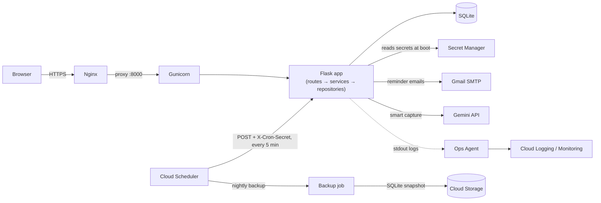

# StartBy

A task manager web app built for the NPN GCP Hackathon (Use Case 1), deployed
on a single Google Compute Engine VM at ₹0 cost. See [`PRD.md`](PRD.md) for
the full spec and [`CLAUDE.md`](CLAUDE.md) for how this repo is built sprint
by sprint.

**Status: Phase 1 complete, Phase 2 in progress (4 of 6 features shipped).**
Auth, task CRUD, the full UI, dark mode, and the reminder cron are all
working and tested, and behind `FEATURE_ESTIMATES`: effort estimates +
start-by time, a green/amber/red risk radar with a "Do this now" card,
start-now reminders, and a per-tag estimate-correction multiplier learned
from completed tasks. **Not yet deployed** — the VM, HTTPS certificate,
Cloud Scheduler job and uptime check in `deploy/README-deploy.md` still
need to be done by hand on the GCP Console, so `v1.0` is not tagged yet.

## Features

- Full task CRUD (add, edit, complete/reopen, soft-delete) with per-user
  isolation
- Tags (work/study/personal), status badges (pending/done/overdue — computed,
  never stored), search and filters
- Dashboard with live counters and a "due next" list
- Activity log: every create/edit/complete/reopen/delete, with before/after
  values, newest first
- Dark mode (saved per user, applied server-side — no flash on load) and a
  settings page for timezone
- Due-date email reminders ("due within 24h" and "overdue"), each sent at
  most once per task, triggered by a single protected cron endpoint
- Mobile-first responsive layout (360px and up)
- *(behind `FEATURE_ESTIMATES`)* Effort estimates with a predicted start-by
  time, a green/amber/red risk radar and dashboard "Do this now" card,
  start-now email reminders, and a per-tag estimate-correction multiplier
  that learns from actual-vs-estimated hours on completed tasks

## Architecture



Routes handle HTTP only, services hold business rules, repositories hold
parameterised SQL — no ORM. All times are stored as UTC and converted to the
user's timezone only at display time (`app/timeutil.py` is the single place
that logic lives). Phase 2 plugs into the extension points already in the
code (`app/services/hooks.py`, feature flags in `.env`) without touching
Phase 1.

**GCP services (11):** Compute Engine runs the app; Cloud Scheduler triggers
the reminder sweep and the nightly backup; Cloud Tasks fires each task's
start-now reminder at its exact start time; Pub/Sub and BigQuery receive
anonymised task events for analytics; Cloud Storage keeps uploaded PDFs and
SQLite backups; Secret Manager holds the secrets; Vertex AI / Gemini powers
smart capture (with a regex fallback); Cloud Logging and Cloud Monitoring
give structured logs, an uptime check and custom metrics; the Google
Calendar API mirrors tasks into a user's own calendar. Every one is optional
and fails safe — see
[`docs/decisions/0008-eleven-service-gcp-stack.md`](docs/decisions/0008-eleven-service-gcp-stack.md)
for what each does, how it stays within a 1 GB VM, and what is *not* free.
`deploy/gcp/provision.sh` creates the resources (not yet run against a real
project).

See [`docs/decisions/`](docs/decisions/) for why Flask/SQLite/a VM/vanilla JS
over the obvious alternatives.

## Local setup (~5 minutes)

```bash
python3 -m venv .venv
source .venv/bin/activate        # Windows: .venv\Scripts\activate
pip install -r requirements-dev.txt
cp .env.example .env             # edit SECRET_KEY at minimum
python wsgi.py                   # http://127.0.0.1:5000
```

Visit `/register` to create an account. The SQLite database is created
automatically at `instance/app.db` (gitignored) and migrated on first run —
nothing else to set up.

To explore with realistic data instead of a blank account:

```bash
python scripts/seed.py            # creates the demo user from .env + 30 tasks
python scripts/seed.py --reset    # wipe and recreate it (e.g. before a demo)
```

## Tests

```bash
pytest                                        # run the suite
pytest --cov=app --cov-report=term-missing    # with coverage
ruff check . && ruff format --check .         # lint
```

The suite is 600+ tests and `ruff` is clean. Every PRD logic invariant has a named
test, e.g. `test_I7_due_soon_reminder_sent_exactly_once...`. The browser-side modules
have Node tests too: `node --test tests/js/*.test.mjs` (CI runs both).

## Deploy

See [`deploy/README-deploy.md`](deploy/README-deploy.md). The primary path is
`deploy/gcp/provision.sh` (two phases: infrastructure, then — once HTTPS is live —
`PHASE=after-https` for the uptime check and Cloud Scheduler jobs); the page lists the
dry-run order, the staging-to-real certbot recipe, secret rotation, and the manual
console flow as the fallback. Target: Compute Engine e2-micro in `us-central1` (Always
Free), Nginx + Gunicorn (2 workers x 4 threads) behind Let's Encrypt, secrets in Secret
Manager, two Cloud Scheduler jobs (reminder sweep, nightly backup to Cloud Storage), and
a Cloud Monitoring uptime check on `/healthz`. The reserved static IP is **billed**
(about $3/month; the new-account credit covers it).

**Known limits:** reminders are at-most-once; emails per sweep are limited by SMTP
latency (about 7-14 per 10 minutes); Google Calendar refresh tokens expire after 7 days
while the OAuth consent screen is in Testing mode; BigQuery streaming needs billing.

## Roadmap

**Built now (Phase 1 + 4 of 6 Phase 2 features):** everything in Features
above, plus effort estimates + start-by time, the risk radar + "Do this now"
card, start-now reminders, and the per-tag estimate-correction multiplier —
all behind `FEATURE_ESTIMATES` (flags-off is byte-identical to v1.0).

**Next (Phase 2, remaining):** Gemini-assisted "smart capture" from pasted
text or a PDF, with a regex + `dateparser` fallback if Gemini is unavailable
(`FEATURE_SMART_CAPTURE`), and an overload-warning report card
(`FEATURE_INSIGHTS`).

**Considered, not built:** Cloud Build/Artifact Registry as a second CI/CD
path alongside GitHub Actions, and the Cloud Natural Language API as a third
text-extraction path alongside Gemini + regex — see
[ADR 0007](docs/decisions/0007-gcp-service-breadth.md).


## Voice assistant ("SARA", `FEATURE_VOICE=1`)

A spoken executive-assistant layer on the dashboard and Smart Capture. The name is
`ASSISTANT_NAME` in `.env`.

| Step | What it does | Needs |
|---|---|---|
| **Briefing** | "Brief me" reads what needs you today: tasks past their start time, ones starting soon, what's due, whether you are overloaded, and abandoned tasks. Built from the app's own data with fixed templates — **no AI call**, so it works offline or over quota. | Browser speech synthesis (all modern browsers) |
| **Voice capture** | A mic on Smart Capture turns *"remind me to submit the lab record by Friday five pm, two hours, and then email the professor"* into draft tasks. Nothing is saved until you review and confirm. | Chrome/Edge/Safari speech recognition, **or** (Brave, Firefox) recording sent to Gemini via `/api/voice/transcribe` — needs `GEMINI_API_KEY`/Vertex |
| **Ask** | Type or say "what should I do now?", "what's due tomorrow?", "how many are overdue?", "am I overloaded?", "how accurate are my estimates?", "why is that the start time?". Read-only, rule-based: it cannot be talked into changing data. "Add …" opens capture. | Same as above for the mic |

Notes: the microphone needs HTTPS (or `localhost`). Audio is only uploaded on the
recording route, only after you tap Stop, and is not stored. Everything spoken is also
shown as text.

### Voice Notes (dictaphone)

With `FEATURE_VOICE=1`, the **Voice Notes** page (and the floating microphone on every page) records what you say, keeps the transcript as a note (the audio is never stored), and can hand any note to Smart Capture ("Turn into tasks"), which previews first. Saving a note never creates a task.
